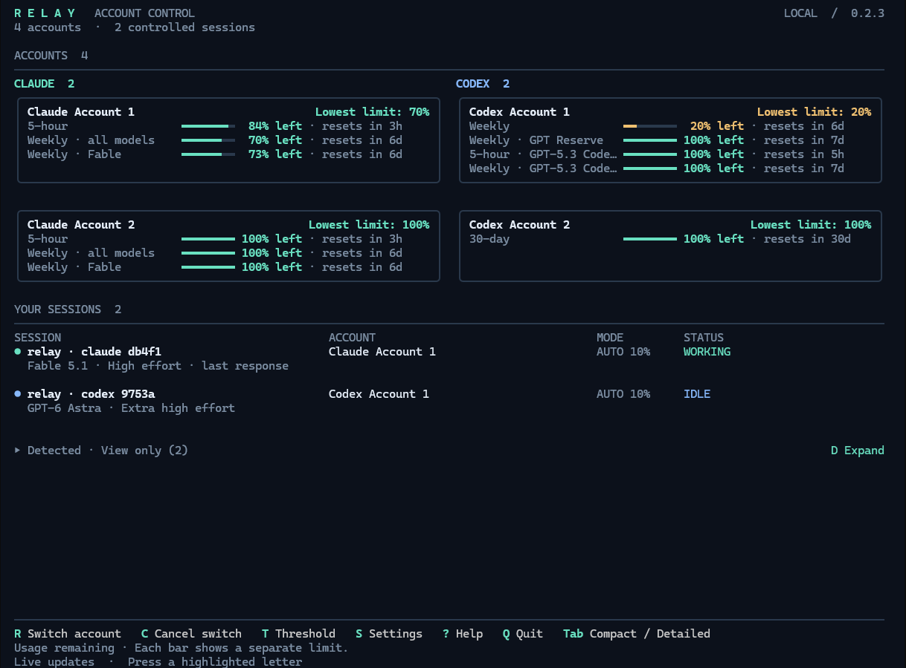
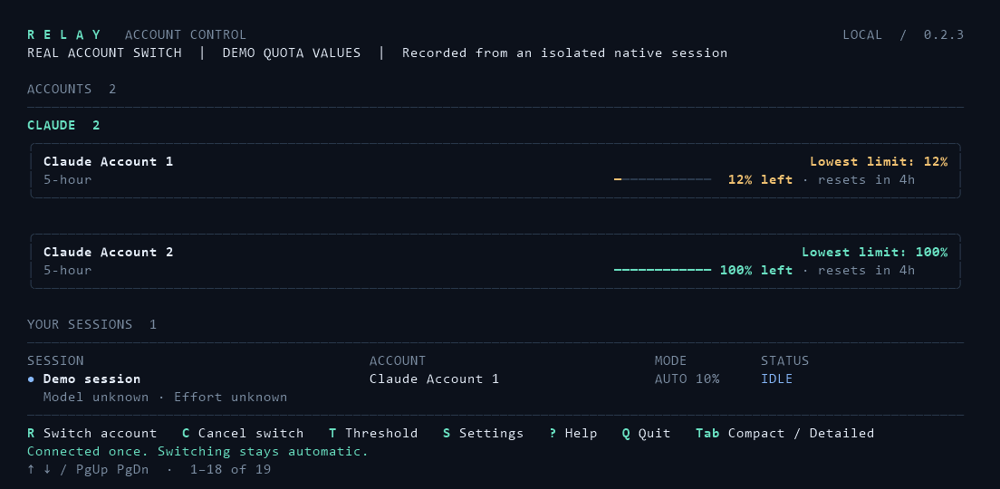
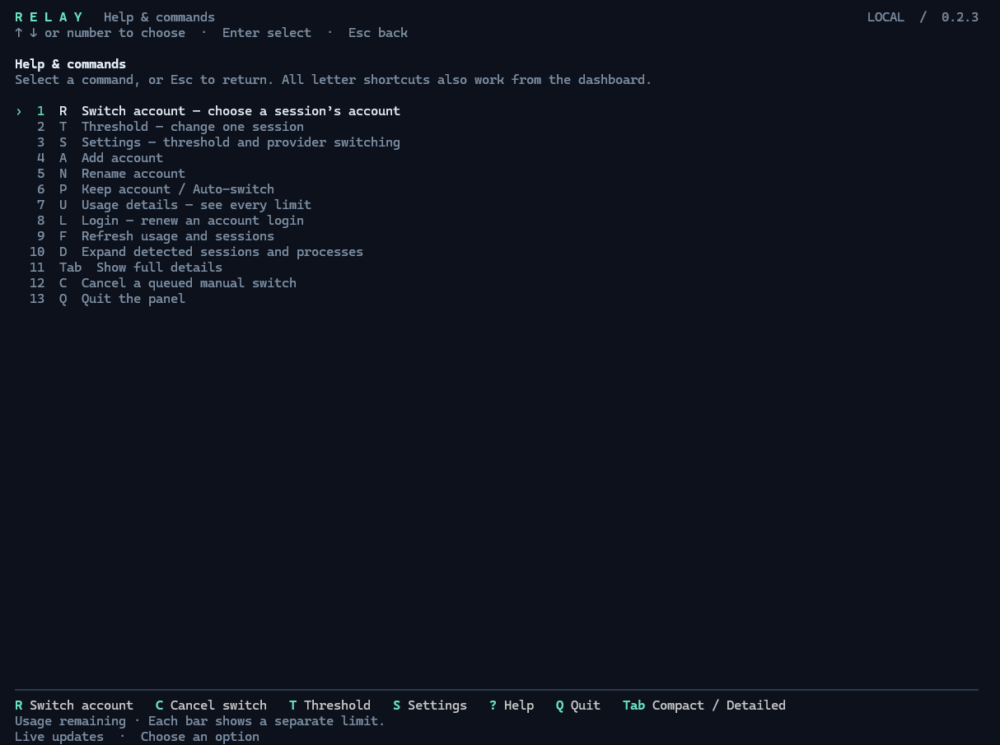

# Relay

### Multiple accounts. No more logout, login, repeat.

Relay automatically switches between your connected **Claude Code and Codex accounts** as usage runs low. Keep working in your usual terminal, choose an account for each session, and let Relay handle account changes at safe stopping points.

You can also hand work from Claude to Codex—or back—with selected conversation context. Provider handoffs are manual by default, with optional automatic fallback.

**Windows · macOS · Free and open source · [MIT license](LICENSE)**

[Get started](#get-started) · [How it works](#how-switching-works) · [Help](docs/troubleshooting.md) · [About the author](#made-by-damir-miljic)



*Every reported limit has its own bar. “Lowest limit” shows the account’s smallest remaining allowance.*

## What you can do

- **Skip repeated logouts and logins.** Connect your accounts once, then switch manually or let Relay switch as remaining usage reaches your threshold. Sign in again only when a login needs renewal.
- **See all your accounts together.** Give each one a name and check its remaining usage, including hourly, weekly, and model-specific limits when available.
- **Choose an account for each session.** Run two terminals on two different accounts, with independent account choices.
- **Switch manually or automatically.** Pick an account yourself, or set a remaining-usage threshold and let Relay queue a change.
- **Keep your normal workflow.** Start `claude` or `codex` in your terminal, including VS Code’s integrated terminal.
- **Hand work to the other provider.** Move between Claude and Codex with a context note. Provider handoffs are manual by default.

## See an automatic switch



*Real accounts and a real native switch, with clearly labelled demo quota values to trigger the threshold. The second account recalls the same conversation. [Recording details](docs/media/README.md).*

## Get started

### 1. Install the prerequisites

You need **Node.js 22 or 24**, **Git**, and **at least one native terminal client: Claude Code or Codex**.

[Node.js](https://nodejs.org/en/download) · [Git](https://git-scm.com/downloads) · [Claude Code setup](https://code.claude.com/docs/en/setup) · [Codex CLI setup](https://learn.chatgpt.com/docs/codex/cli)

Install and sign in to the client you plan to use. Add the other provider later by installing its client and running `relay install` again. Relay is free; access to each provider comes from your own account.

### 2. Install Relay once

Run these commands in PowerShell on Windows, or Terminal on macOS:

```sh
git clone https://github.com/Damir-Miljic/relay.git
cd relay
npm ci
node bin/relay.mjs install
```

Keep this folder where you installed it. Relay’s terminal integration points to it.

### 3. Open Relay and keep working

Open a **new terminal** and run:

```sh
relay
```

Press **A** to connect and name another account. Supported existing logins are picked up during installation.

In another new terminal, go to your project folder and start **either** `claude` or `codex` as usual. It appears under **Your sessions**. Use **R Switch account** in Relay to choose its account.

[Full installation guide, ZIP download, updates, and removal →](docs/installation.md)

## Everyday controls

Press a highlighted letter in the Relay panel. Use arrows or a number to choose an option, **Enter** to select, and **Esc** to go back.

| Key | Action |
| --- | --- |
| **R Switch account** | Switch a session’s account. A manual choice enables Keep account. |
| **C Cancel switch** | Cancel a manual switch while it is still queued. |
| **P** | Change a session between Keep account and Auto-switch. |
| **T** | Set one session’s switching threshold. |
| **S** | Set the default threshold and optional automatic provider handoffs. |
| **A** | Connect and name an account. |
| **U** | Inspect every usage limit and any refresh error. |
| **Tab** | Change between compact and detailed views. |
| **?** | Open all commands, including rename, login, and refresh. |
| **Q** | Close the panel. Your sessions and the background service keep running. |

**Example:** Start two Claude terminals. Press **R Switch account**, choose the first session, then choose “Claude Personal.” Repeat for the second session with “Claude Work.” Each stays on its selected account. Use **P** if you want either session to switch automatically later.

New integrated sessions use their provider’s default account and **Auto at 10% remaining**. In **S**, you can change the default to **1–100%**; existing sessions keep their own settings.

<details>
<summary><strong>See the full command menu</strong></summary>



[Complete keyboard and command-line guide](docs/usage.md)

</details>

## How switching works

| Change | What happens |
| --- | --- |
| **Claude → another Claude account** | Relay waits for a safe stopping point, closes Claude cleanly, and resumes the saved conversation in the same terminal under the selected account. |
| **Codex → another Codex account** | Relay changes the account for that session’s Codex service and keeps the same thread. |
| **Claude ↔ Codex** | A **new conversation** starts in the same terminal and project, using a note with selected context from the previous conversation. The original chat stays saved. |

A queued switch waits for a safe point. Active tools, working agents, permissions, unsubmitted drafts, or background work can delay it. The panel shows the reason; reaching a threshold does not force an unsafe restart.

Before a manual provider handoff, Relay explains that selected conversation and tool-result text will be sent to the receiving provider. Full history, internal reasoning, model settings, and tool configuration are not transferred. Automatic provider fallback is **off by default** and can be enabled in **S Settings**.

### What to expect

- **Remaining usage, not usage spent.** Each bar is a separate limit. Unknown or stale readings are marked and are not treated as spare capacity.
- **Normal terminal sessions are controllable after installation.** Sessions started earlier, dedicated desktop-app chats, and IDE chat panels can appear under **Detected · View only**.
- **Model and effort appear when reported.** Claude’s values describe its last recorded response.
- **Accounts and logins stay on your machine.** Relay does not upload credentials to a hosted Relay service. Provider calls still go to Claude or Codex as usual.
- **ChatGPT web message limits are not included.** Relay does not combine accounts into a shared quota.

Relay is an early release. Native client updates can affect integration; [troubleshooting](docs/troubleshooting.md) and [tested coverage](docs/testing.md) explain the current scope.

## Need a hand?

- [Install, update, or uninstall](docs/installation.md)
- [Accounts, switching, settings, and commands](docs/usage.md)
- [Troubleshoot usage, detection, or queued switches](docs/troubleshooting.md)
- [How the integration works](docs/architecture.md)
- [Contribute or report a bug](CONTRIBUTING.md)

## Made by Damir Miljic

Relay is shared for free under the [MIT license](LICENSE), by **[Damir Miljic](https://linkedin.com/in/damirmiljic)**.

If you share Relay on LinkedIn or other social media, **please mention Damir Miljic and link to this repository**. On LinkedIn, you can tag me through [my profile](https://linkedin.com/in/damirmiljic). It helps people find the project and gives credit for the work.

A simple credit: **Relay by [Damir Miljic](https://linkedin.com/in/damirmiljic) — [GitHub](https://github.com/Damir-Miljic/relay).**

Social credit is appreciated, not an additional condition of the MIT license.

---

Relay is an independent project and is not affiliated with or endorsed by Anthropic or OpenAI.
